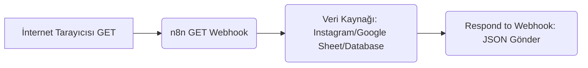

# n8n Bildirim Altyapısı Kurulum Rehberi 🚀

Bu rehber, **Ilgın İnsanı** esnaf portalından gönderilen kampanya taleplerini anında yöneticinin (senin) telefonuna **Telegram** üzerinden bildirim olarak düşürecek n8n iş akışının nasıl kurulacağını adım adım anlatır.

---

## 🗺️ Genel Çalışma Mimarisi

```mermaid
graph LR
    A[esnaf.html Formu] -- POST (JSON) --> B(n8n Webhook Düğümü)
    B --> C(Telegram Send Message)
    C --> D[Yönetici Telefonu (Bildirim)]
```

---

## 1. Aşama: Telegram Botunun Hazırlanması 🤖

n8n üzerinden bildirim göndermek için kendine özel bir Telegram botu oluşturmalısın:

1. Telegram'da **@BotFather** kullanıcısını ara ve sohbet başlat.
2. `/newbot` komutunu gönder.
3. Botuna bir isim ver (Örn: `Ilgın İnsanı Asistanı`).
4. Botun için benzersiz bir kullanıcı adı belirle (Örn: `ilgin_insani_admin_bot`).
5. BotFather sana bir **HTTP API Token** (Erişim Anahtarı) verecektir. Bu token'ı kopyala ve güvenli bir yere kaydet (Örn: `718293812:AAHj8-xyz...`).
6. Botunu Telegram'da aratıp **Başlat (Start)** butonuna tıkla (Bu adım botun sana mesaj atabilmesi için zorunludur).
7. Kendi **Chat ID** değerini öğrenmek için Telegram'da **@userinfobot**'a mesaj at. Bu bot sana sayısal bir Chat ID verir (Örn: `123456789`).

---

## 2. Aşama: n8n İş Akışının Kurulması (Workflow) 🌐

n8n panelinde yeni bir iş akışı oluştur ve şu iki düğümü (node) bağla:

### 1. Düğüm: Webhook (Giriş Düğümü)
Bu düğüm, `esnaf.html` sayfasından gönderilen form verilerini karşılar.

- **Name:** `Esnaf Kampanya Talep Webhook`
- **Method:** `POST`
- **Path:** `esnaf-kampanya-talep` (Webhook URL'niz: `https://n8n.ilgininsani.com/webhook/esnaf-kampanya-talep` olacaktır)
- **Authentication:** `None` (veya isteğe bağlı olarak Basic Auth / Header Auth ekleyebilirsiniz)
- **Response Mode:** `On Received`
- **Response Code:** `200`

### 2. Düğüm: Telegram (Aksiyon Düğümü)
Verileri aldıktan sonra Telegram üzerinden sana mesaj gönderir.

- **Resource:** `Message`
- **Operation:** `Send`
- **Credentials (Bağlantı Bilgisi):** Yeni bir Telegram credentials oluştur ve BotFather'dan aldığın **Access Token**'ı gir.
- **Chat ID:** `@userinfobot`'tan öğrendiğin kendi kişisel Chat ID değerini gir.
- **Text (Mesaj Metni):** Aşağıdaki şablonu kopyalayıp mesaj içeriği kısmına yapıştır. n8n gelen form verilerini bu şablona otomatik yerleştirecektir:

```html
🔔 <b>Yeni Esnaf Kampanya Talebi!</b>
━━━━━━━━━━━━━━━━━━
🏢 <b>İşletme Adı:</b> {{ $json.body.isletme }}
👤 <b>Yetkili Kişi:</b> {{ $json.body.yetkili }}
📞 <b>Telefon:</b> {{ $json.body.telefon }}
🏷️ <b>Kategori:</b> {{ $json.body.kategori }}
📝 <b>Kampanya:</b> {{ $json.body.kampanyaBasligi }}

⏳ <b>Süre:</b> {{ $json.body.sure }} Gün
📦 <b>Paket Tipi:</b> {{ $json.body.paket.toUpperCase() }}
💵 <b>Ucret (Hesaplanan):</b> ₺{{ $json.body.ucret }}

💸 <b>Eski Fiyat:</b> {{ $json.body.eskiFiyat || '—' }} TL
🎯 <b>Yeni Fiyat:</b> {{ $json.body.yeniFiyat || '—' }} TL
🔑 <b>İndirim Kodu:</b> {{ $json.body.promokod || 'Yok' }}

💬 <b>Ek Not:</b>
{{ $json.body.notlar || 'Not bırakılmadı.' }}
━━━━━━━━━━━━━━━━━━
⚙️ <i>Onaylamak veya düzenlemek için Admin Panelini ziyaret edin.</i>
```

- **Add Option > Parse Mode:** `HTML` olarak seç (Mesajın kalın ve italik yazılması için gereklidir).

---

## 3. Aşama: Web Sitesi ile n8n'i Test Etme 🧪

1. n8n panelinde sağ üstteki **Listen for test event** (Test Olayını Dinle) butonuna tıkla.
2. Tarayıcında `esnaf.html` sayfasını aç.
3. Form alanlarını doldur ve **Talebi Gönder** butonuna bas.
4. n8n ekranında verilerin düştüğünü göreceksin. Aynı anda telefonuna Telegram üzerinden yukarıdaki gibi şık formatta bir bildirim gelecektir!
5. Test başarılı ise n8n akışını **Active** (Aktif) durumuna getirerek yayına alabilirsin.

---

---

## 4. Aşama: Canlı Instagram Vitrini için n8n Akışı Kurulumu 📸

Web sitesinin ana sayfasındaki **"Instagram'da Biz"** bölümünü dinamik Instagram gönderileri ile beslemek için n8n üzerinde bir API/Webhook akışı oluşturabilirsin:

### n8n Akış Aşamaları:


### Kurulum Adımları:
1. **Webhook Düğümü (GET):**
   - **Method:** `GET`
   - **Path:** `instagram-showcase` (Yani tetiklenecek adres: `https://n8n.ilgininsani.com/webhook/instagram-showcase` olacak)
   - **Response Mode:** `Using 'Respond to Webhook' Node`

2. **Veri Kaynağını Bağlama (Seçenekler):**
   - **Seçenek A (Kolay ve Kontrollü):** Bir **Google Sheet** oluşturup sütunları `imageUrl`, `link`, `likes`, `comments`, `type`, `caption` olarak belirle. n8n'de **Google Sheets (Read Rows)** düğümü ile bu satırları oku. (Bu sayede hangi gönderilerin sitede duracağını kendin yönetirsin).
   - **Seçenek B (Resmi Entegrasyon):** n8n içerisindeki **Instagram** düğümünü kullanarak `@ilgin.insani` hesabının son medya gönderilerini otomatik çek.

3. **Respond to Webhook Düğümü (Yanıt):**
   - **Response Source:** `Bu düğümün girdisi (Input data)`
   - **Response Body:** Google Sheet'ten veya Instagram'dan gelen veriyi dizi (Array of JSON objects) halinde tarayıcıya geri döner.
   - Dönecek veri formatı şu şekilde olmalıdır:
     ```json
     [
       {
         "imageUrl": "https://resim-adresi.com/gorsel.jpg",
         "link": "https://www.instagram.com/p/C_postsLink/",
         "likes": "1,450",
         "comments": "32",
         "type": "photo", // "photo" veya "reels"
         "caption": "Ilgın'ın eşsiz güzellikleri..."
       }
     ]
     ```

---

## 💡 Esnaflara Katkı Sağlayacak Ek Fikirler

Esnafların ilgisini çekmek ve süper uygulamayı daha popüler hale getirmek için şu fikirleri de düşünebilirsin:
1. **Kasada Çekiliş Modülü:** Esnafın dükkanına asacağı QR kodunu okutan kullanıcılara sürpriz indirimler veya küçük hediyeler (örn. çay/kahve) çıkacak dijital bir şans çarkı.
2. **Yapay Zeka Destekli Kampanya Yazarı:** Esnaflar kampanya oluştururken başlık bulmakta zorlanıyorsa, yapay zekanın girdi olarak verilen ürün adına göre (örn: "kıymada indirim") esnafa ilgi çekici reklam/kampanya sloganları üretmesi (bunu formun yanına küçük bir buton ile ekleyebiliriz).
3. **Müşteri Yorum Kartları:** Esnaflar için "Bizden memnun kaldınız mı? Yorum bırakın" yazılı özel QR kod tasarımları üretip dükkan masalarına koymalarını sağlamak.
